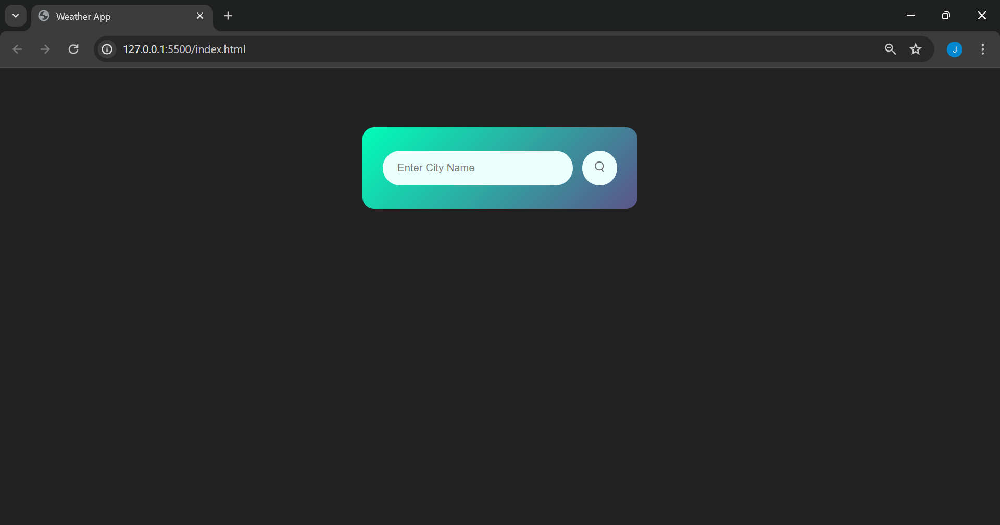
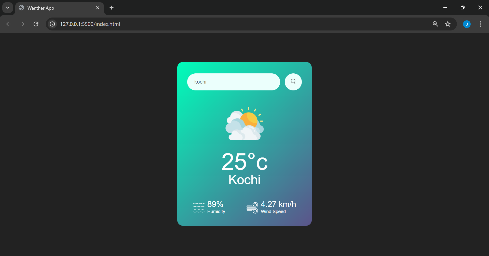

<b>WeatherNow</b>

## About

**WeatherNow** is a simple and responsive web application built using **HTML**, **CSS**, and **JavaScript**. It allows users to check the current weather conditions of any city in the world. The app fetches real-time weather data from the **OpenWeather** API using a free API key.

## Features

- Search weather by city name  
- Displays temperature (in Celsius)  
- Shows weather condition (like clear, cloudy, rain)  
- Humidity percentage  
- Wind speed (in km/h)  
- Real-time data from OpenWeatherMap API  
- Responsive and user-friendly interface

## Technologies Used

- HTML  
- CSS  
- JavaScript  
- [OpenWeatherMap API](https://openweathermap.org/)

## 🚀 How It Works

1. User enters the **city name** in the input box.
2. On clicking the search button, the app makes a request to the **OpenWeatherMap API**.
3. Weather data is retrieved and displayed dynamically on the webpage.

## Screenshots

- **Dashboard**

   
- **Show Weather**

   
- **Error**

